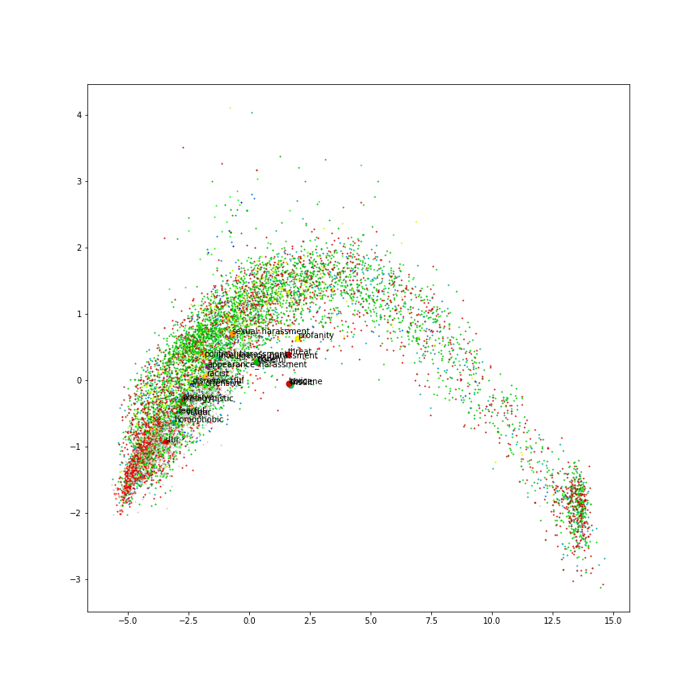
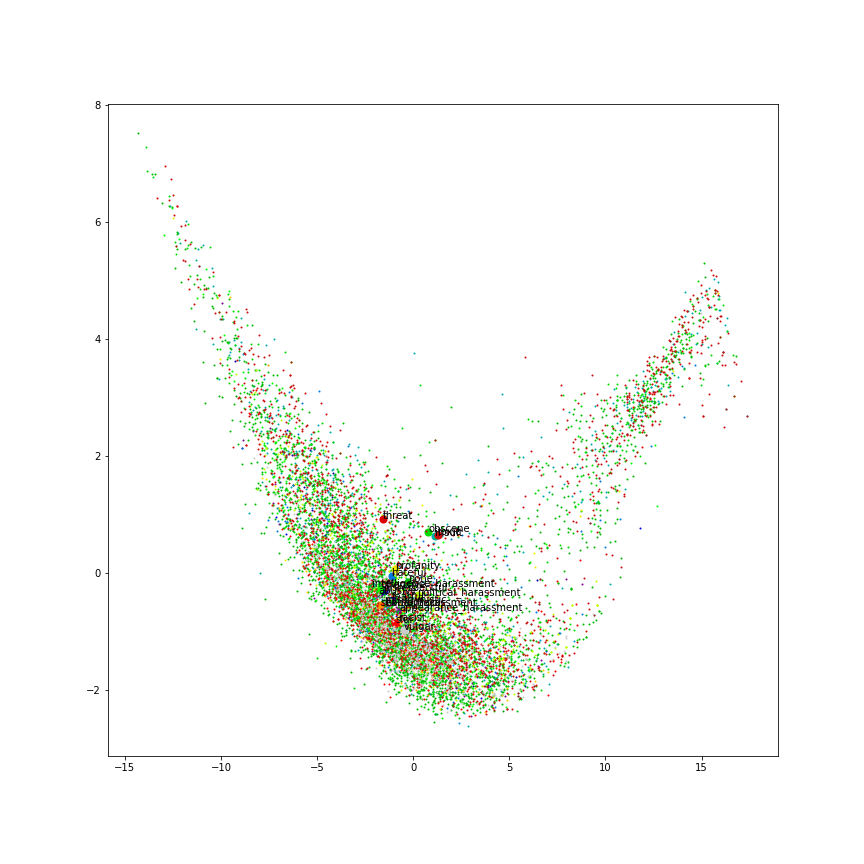
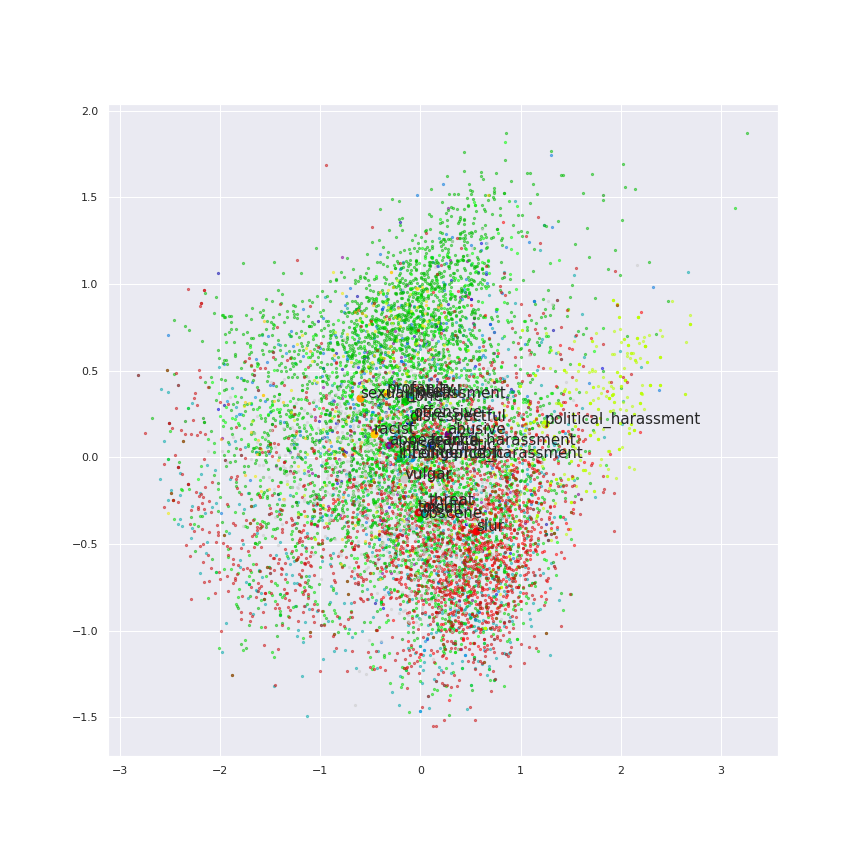
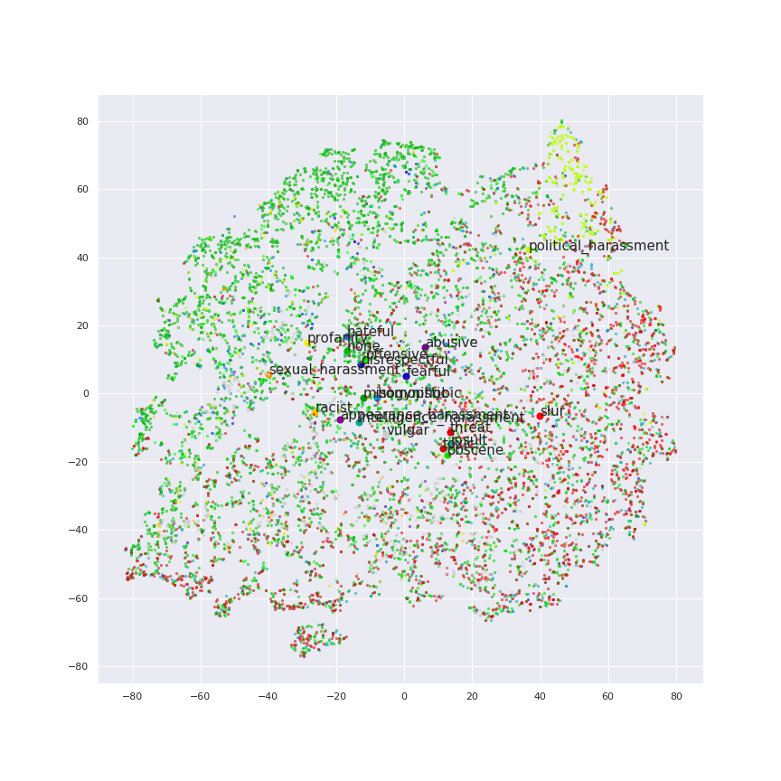
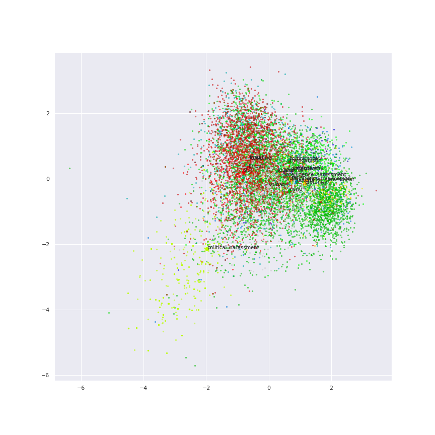

*Kratka razlaga, kaj sem počel in kakšni so rezultati.*

Cel nas dataset sem razdlil na train (80%), validation (10%) in test (10%).

## Plain BERT

Vzel sem pre-trained BERT model `bert-base-cased` in naredil predikcijo na test subsetu.

Rezultat mreze je:
- `last_hidden_state`, tensor oblike `(n_observations, sentence_length, 768)`
- `pooled_output`, tensor oblike `(n_observations, 768)`

Ko sem na `last_hidden_state` naredil `mean(axis=1)` in PCA v 2 dimimenziji sem dobil:

Ko sem na `pooled_output` naredil PCA v 2 dimimenziji sem dobil:

## Fine-tuned Sentiment Embedding BERT

Naredil sem nov model, ki vsebuje BERT kot prvi layer in dva dense layerja. Prvi dela *embedding* iz BERTovega `pooled_output` v 10 dimenzij, drugi pa *classification* v 20 dimenzij (ena za vsak class).

Zadnja dva layer-ja sem ucil nekaj casa, niti en epoch, loss je nehal padati in accuracy je nehal rasti.

    Fine-tuning BERT
    Epoch 1/3
    4942/32555 [===>..........................] - ETA: 56:21 - loss: 2.7415 - accuracy: 0.3425

Acccuracy na test subsetu je `0.337` (baseline random prediction bi bil `1/20 = 0.05`)

Naredil sem prediction na test subsetu in tole so rezultati z PCA:

In z tSNE:

In z LDA (ni najbolje, ker sem za teniranje LDA uporabil label-e iz test subseta):

