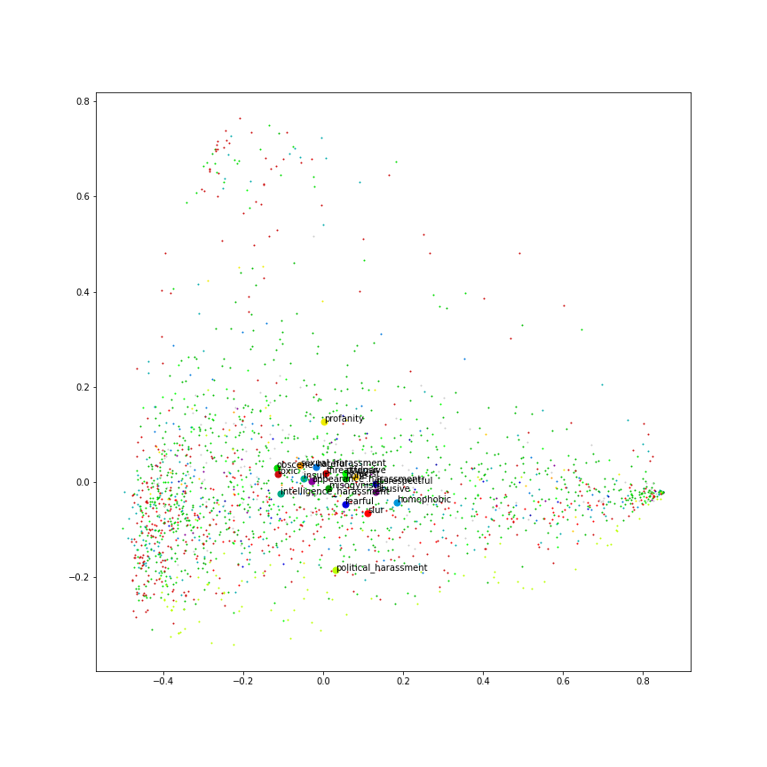
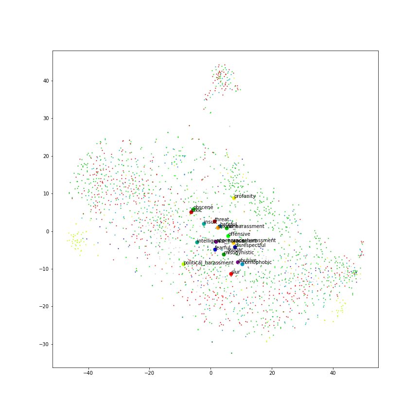

*Kratka razlaga, kaj sem počel in kakšni so rezultati.*

Uporabil sem [`simple-elmo`](https://pypi.org/project/simple-elmo/), ki je wrapper okoli *moderne* TF implementacije origanalnega paper-ja.

Za iniclializacijo sem uporabil model id 194 iz [NLPL word embeddings repository-ja](http://vectors.nlpl.eu/repository/#).

Ker tudi z GPU sprocesira cca 15 stavkov/sec, sem naredil sample 2000 observation-ov iz celaga dataseta.

Tole so rezultati z PCA:

In z tSNE:

